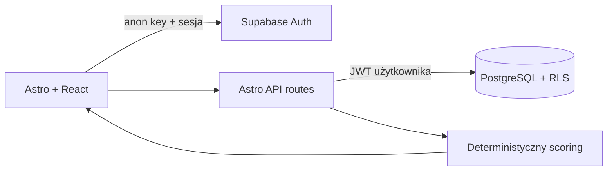

# AI Concept Compass

Polskojęzyczna aplikacja do kalibracji wiedzy przed AWS Certified AI
Practitioner. Użytkownik deklaruje pewność, odpowiada własnymi słowami, porównuje
odpowiedź ze wzorcem i otrzymuje deterministyczną rekomendację kolejnego tematu.

MVP celowo nie używa LLM. Jego wartość — wykrywanie luk mastery i nadmiernej
pewności — działa przewidywalnie, tanio i jest w pełni testowalna.

> **Stan 1 sierpnia 2026:** aplikacja działa publicznie na
> [Cloudflare Workers](https://ai-concept-compass.dudziak-michal.workers.dev).
> Pełny CI dla merge commitu Buildera ([run 30715121885](https://github.com/dudziakm/ai-concept-compass-greenfield/actions/runs/30715121885))
> ma zielone `quality`, `e2e` i `rls`, a świeży, uwierzytelniony E2E przeciwko
> publicznemu Workerowi przeszedł 4/4. Dokładne wersje Workera, URL-e i
> screenshoty zapisuje [publiczny rekord weryfikacji](context/evidence/builder-public-verification-2026-08-01.md).
> Świeża rejestracja z kliknięciem prawdziwego linku e-mail, decyzja o Leaked
> Password Protection, zaufanie hookowi M3 i wysłanie formularza nadal wymagają
> jawnego działania właściciela konta.

## Najważniejszy przepływ

```text
logowanie → pakiet 10 pojęć → pewność 1–5 → odpowiedź
→ samoocena wyniku → mastery + luka kalibracji → rekomendacja
```

Pakiet jest autorski i oparty na oficjalnym [AWS Certified AI Practitioner
Exam Guide](https://docs.aws.amazon.com/aws-certification/latest/ai-practitioner-01/ai-practitioner-01.html)
dla blueprintu AIF-C01 v1.1. Repozytorium nie zawiera skopiowanych pytań
egzaminacyjnych.

## Stack

- Astro 6 SSR, React 19, TypeScript i Tailwind CSS 4;
- hosted Supabase: PostgreSQL, Auth i Row Level Security;
- Cloudflare Workers;
- Zod 4, Vitest 4 i Playwright;
- GitHub Actions na Node 22.14.



Klucz `service_role` nie jest używany przez aplikację. Każdy zapis przekazuje
`user_id` zalogowanego użytkownika, a baza niezależnie wymusza ten sam warunek
przez RLS.

## Logika rekomendacji

- wynik: incorrect `0`, partial `50`, correct `100`;
- pewność: `(confidence - 1) × 25`;
- mastery: pierwszy wynik albo `0.6 × poprzednie + 0.4 × wynik`;
- nadmierna pewność: `max(0, pewność - wynik)`;
- powtórka: `+1`, `+3`, `+7`, a po dwóch poprawnych `+14` dni;
- priority: 70% luki mastery + 30% nadmiernej pewności + do 20 punktów
  przeterminowania, zawsze w zakresie 0–100;
- nowe pojęcie ma priorytet 100; terminy wymagające powtórki wygrywają przed
  samym wynikiem priority.

`now` jest przekazywane do funkcji domenowych, dzięki czemu testy nie zależą od
zegara systemowego.

## API

| Metoda               | Endpoint                    | Cel                               |
| -------------------- | --------------------------- | --------------------------------- |
| GET / POST           | `/api/concepts`             | lista i tworzenie pojęć           |
| GET / PATCH / DELETE | `/api/concepts/:id`         | odczyt, edycja i usunięcie        |
| POST                 | `/api/concepts/:id/reviews` | zapis oceny i scoring             |
| POST                 | `/api/starter-pack`         | idempotentne dodanie 10 szablonów |
| GET                  | `/api/dashboard`            | postęp domen i rekomendacja       |

Zapisy są walidowane przez Zod. Błędy mają wspólny format JSON i statusy
400/401/404/409/500.

## Uruchomienie

Wymagany jest Node 22.14 (`.nvmrc`) oraz projekt Supabase.

```bash
npm ci
npm ci --prefix packages/code-reviewer
cp .env.example .env
```

W `.env` ustaw `SUPABASE_URL` i publiczny klucz anon/publishable
`SUPABASE_KEY`. Następnie połącz projekt i zastosuj migrację:

```bash
npx supabase login
npx supabase link --project-ref <project-ref>
npx supabase db push
npm run dev
```

Migracja `supabase/migrations/20260731190000_ai_concept_compass.sql` tworzy
tabele, polityki RLS, indeksy i pakiet 10 szablonów. Logowanie do Supabase jest
czynnością użytkownika; sekret dostępu nie trafia do repozytorium.

## Rozwój w Cursor

Cursor jest podstawowym środowiskiem pracy. Otwórz bezpośrednio katalog tego
repozytorium (albo docelowy worktree), aby załadować wersjonowane:

- reguły w [`.cursor/rules/`](.cursor/rules/);
- skill przeglądu kodu w [`.cursor/skills/code-review/`](.cursor/skills/code-review/);
- fail-open hook jakości w [`.cursor/hooks.json`](.cursor/hooks.json).

Hook Cursor uruchamia lint i typecheck po edycji dokonanej przez agenta. Nie
blokuje zapisu: nieudana bramka zwraca kontekst z instrukcją naprawy, a pełną
weryfikację uruchamiasz jawnie. Codex pozostaje kompatybilnym, opcjonalnym
wariantem; jego hook jest opisany niżej.

Kanoniczny skill wymagany przez CI i dowody Champion znajduje się w
[`skills/code-review/SKILL.md`](skills/code-review/SKILL.md); jego kopia Cursor
jest sprawdzana pod kątem identycznej treści. Opublikowany
[`@dudziakm/ai-toolkit`](packages/ai-toolkit/README.md) pozostaje osobnym
kanałem dla konsumentów Claude Code — nie jest wymagany do pracy w Cursor ani
instalowany w tym repozytorium.

## Testy i bramki

```bash
npm run verify:fast # lint + typecheck + szybkie testy
npm run verify:full # bramki CI poza E2E/RLS wymagającymi hostowanych sekretów
```

Lokalny pakiet ma 53 testy scoringu, schematów, migracji oraz tras API i 100%
pokrycia instrukcji, funkcji, linii oraz gałęzi silnika scoringu. Statyczny test
migracji sprawdza RLS, cascade i idempotencję; osobny hosted harness wykonuje
rzeczywistą macierz dwóch użytkowników. 1 sierpnia 2026 macierz przeszła 3/3.

E2E wymaga potwierdzonego konta testowego oraz zmiennych
`E2E_USER_EMAIL`/`E2E_USER_PASSWORD`:

```bash
npx playwright install chromium
npm run test:e2e
```

Setup Playwright loguje konto raz do `storageState` i czyści jego dane. Główny
scenariusz przechodzi przez prawdziwe auth, routing, API i bazę: pakiet → edycja
→ review → rekomendacja → usunięcie. Artefakty uwierzytelnienia są ignorowane
przez Git. Krytyczny scenariusz przeszedł również pięć kolejnych powtórzeń bez
niestabilności. Sama trasa rejestracji ma test integracyjny; pełna rejestracja z
potwierdzeniem e-mail pozostaje manualnym testem hosted, ponieważ zależy od
zewnętrznego dostawcy poczty.

Test RLS wymaga dwóch potwierdzonych zwykłych kont i świadomie nie używa
`service_role`:

```bash
SUPABASE_URL=... SUPABASE_KEY=... \
RLS_USER_A_EMAIL=... RLS_USER_A_PASSWORD=... \
RLS_USER_B_EMAIL=... RLS_USER_B_PASSWORD=... npm run test:rls
```

CI wymaga czterech sekretów E2E (`SUPABASE_URL`, `SUPABASE_KEY`,
`E2E_USER_EMAIL`, `E2E_USER_PASSWORD`) oraz danych dwóch kont `RLS_USER_A_*` i
`RLS_USER_B_*`. Quality, E2E i RLS są osobnymi bramkami merge.

### Hooki jakości po edycji

Projektowy hook Cursor w [`.cursor/hooks.json`](.cursor/hooks.json) reaguje na
edycje agenta `Write` lub `TabWrite`. Uruchamia fail-open wrapper
[`post-edit-quality.sh`](.cursor/hooks/post-edit-quality.sh), który korzysta z
[`scripts/post-edit-quality.sh`](scripts/post-edit-quality.sh) i wykonuje
`npm run lint` oraz `npm run typecheck`. Limit wynosi 120 sekund. To lokalny
feedback po edycji, nie zamiennik testów, CI, review ani sprawdzeń hosted.

Opcjonalny hook Codexa w [`.codex/hooks.json`](.codex/hooks.json) zachowuje
dotychczasowy matcher `apply_patch` i używa tego samego skryptu jakości. Codex
wymaga ręcznego trustu definicji przez właściciela w `/hooks`. Żaden wariant nie
odczytuje ani nie loguje plików `.env`.

## Wdrożenie na Cloudflare Workers

Po zalogowaniu do Cloudflare ustaw dwa sekrety i wdroż aplikację:

```bash
npx wrangler login
npx wrangler secret put SUPABASE_URL
npx wrangler secret put SUPABASE_KEY
npx wrangler deploy
```

Dodaj publiczny URL do listy dozwolonych redirect URL w Supabase Auth.

## Dokumentacja procesu

- [Shape notes](context/foundation/shape-notes.md)
- [PRD](context/foundation/prd.md)
- [Wymagania biznesowe i traceability](context/foundation/business-requirements.md)
- [Tech stack](context/foundation/tech-stack.md)
- [Wymagania techniczne](context/foundation/technical-requirements.md)
- [Infrastruktura i granice sekretów](context/foundation/infrastructure.md)
- [Roadmapa i dependency graph](context/foundation/roadmap.md)
- [Plan testów](context/foundation/test-plan.md)
- [Research, plan wdrożenia i bieżący postęp](context/changes/ai-concept-compass-mvp/plan.md)
- [Specyfikacja API](context/changes/ai-concept-compass-mvp/specs/api.md)
- [Specyfikacja bazy i RLS](context/changes/ai-concept-compass-mvp/specs/database.md)
- [Specyfikacja UI](context/changes/ai-concept-compass-mvp/specs/ui.md)
- [Plan deployu](context/deployment/deploy-plan.md)
- [Audyt MVP](context/evidence/builder-mvp-check.md)
- [Cursor-first workflow verification](context/evidence/cursor-first-workflow-2026-08-05.md)
- [Current certification status](context/evidence/certification-status-2026-08-05.md)
- [Agent code review — runbook](context/team/reviewer-runbook.md)

## Jak agenci AI wspierali proces

Agenci AI pomogli rozbić zakres na testowalne granice, przygotować migrację,
API, interfejs i testy oraz wykonywać bramki jakości. Reguły biznesowe, zakres
MVP, źródło treści i kryteria akceptacji pozostają jawne w repozytorium, zamiast
być ukryte w promptach lub wyniku modelu.

## Licencja

MIT
